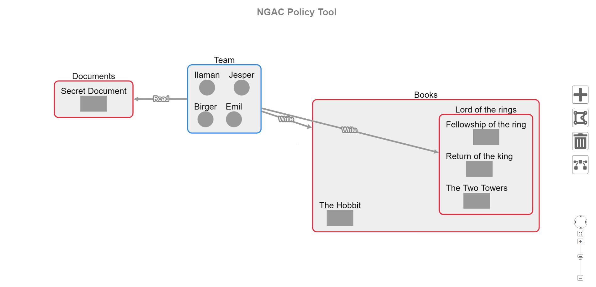
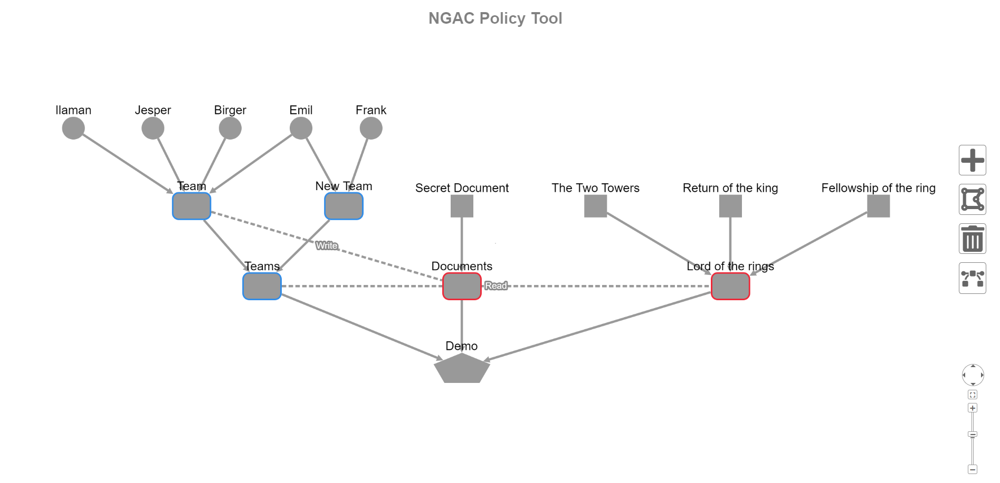

# NGAC-graph-UI
NGAC ([Next Generation Access Control](https://www.nist.gov/patents/next-generation-access-control-system-and-process-controlling-database-access)) user interface for a frontend 
project built on [cytoscape.js](https://js.cytoscape.org/). The UI provides easy-to-use features for creating and editing access control policies in accordance with 
the NGAC framework.

A later version of this UI together with a complete front end solution can be found at [github.com/Emn98/D0020E](https://github.com/Emn98/D0020E), there you'll
find added graph features for database integration, file handling and more.

## Directed acyclic graph version
An alternative DAG version is also included in this repository; this approach is more in line with what the originators of the NGAC Policy Machine had in mind but was not part of our final solution due to visual preference and tedious layout management with access right edges. 

